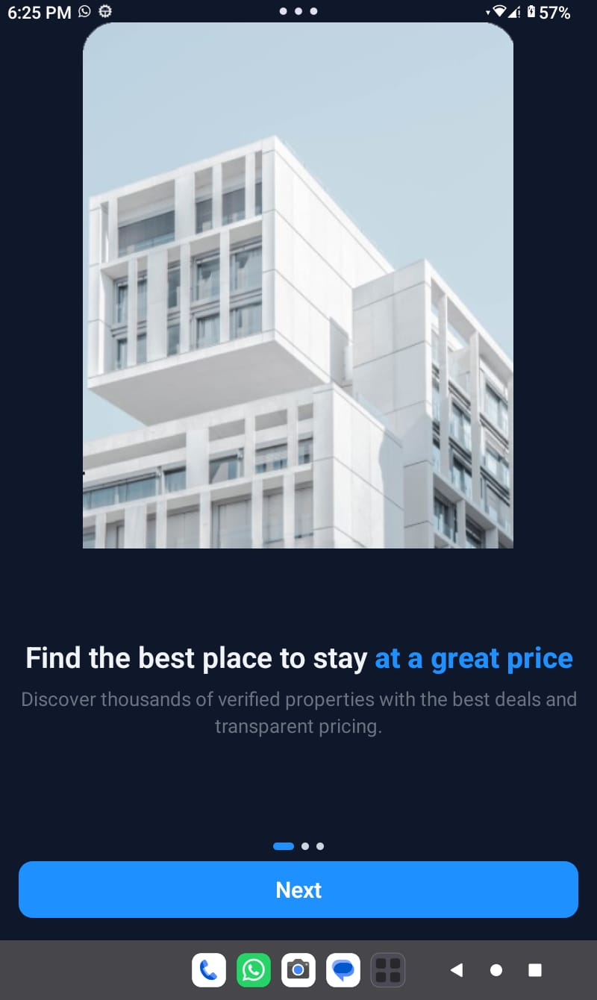
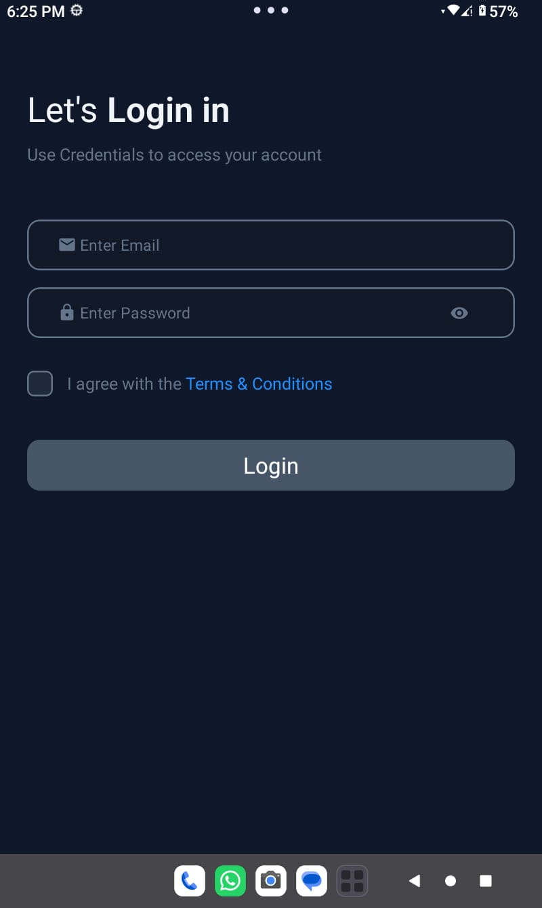
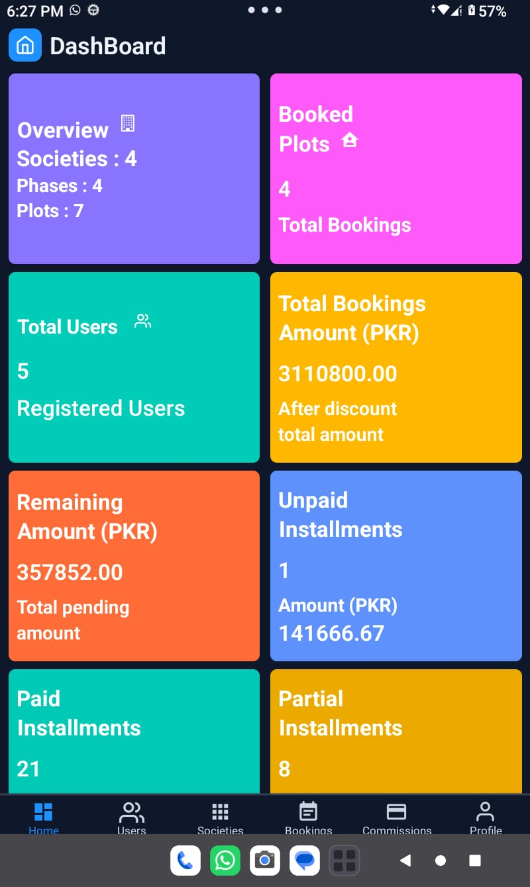
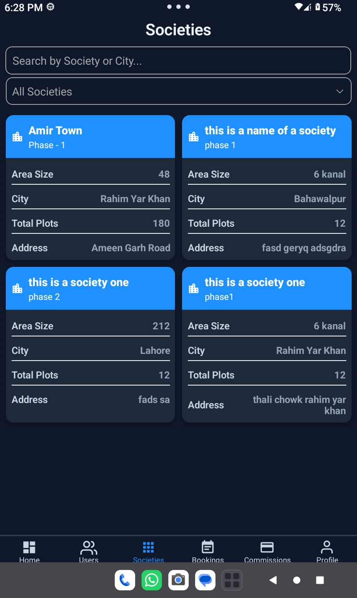
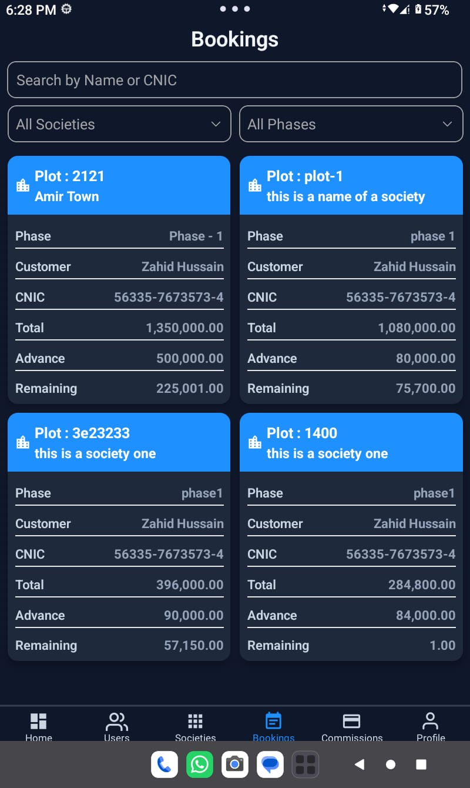
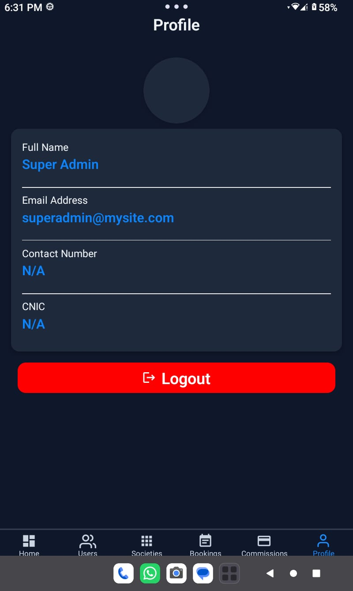

🏡 Dream Home – Real Estate Management App (React Native)

A role-based Real Estate mobile application built with React Native and REST APIs. It includes Super Admin, Admin, and Customer panels for managing societies, bookings, installment tracking, commissions, and payments with secure authentication and workflow-based system design.

🔐 Role-Based Navigation Logic

The application uses REST API login response to determine the user role and navigate them to the correct dashboard automatically.

After successful login:

• Super Admin → Super Admin Tab Screens

• Admin → Admin Tab Screens

• Customer → Customer Tab Screens

This ensures a secure role-based access system where each user sees only relevant features.

The role is stored using AsyncStorage and used throughout the app for session persistence.

## 📸 App Screenshots

### OnBoarding

### Login
 , (src/Assets/screenshots/login2.jpeg)

### Dashboard

### Societies + Detail
 , (src/Assets/screenshots/societiesdetail.jpeg)

### Bookings + Installment
 , (src/Assets/screenshots/bookingsdetailORinstallment.jpeg)

### Commissions

### Profile

👑 Super Admin Features

Dashboard :

• Overview of system activity
• Navigation to all modules

Societies Management :

• View all societies
• Navigate to Society Detail Screen

Bookings Management :

• View all booked plots
• Manage installment payments
• Update payment status (Paid / Unpaid / Partial)
• REST API integration

Commission Management :

• Assign commissions to admins
• Track commission status (Paid / Unpaid / Partial)

Profile & Logout :

• Name, Email, CNIC
• AsyncStorage-based session

🧑‍💼 Admin Features

Societies :

• View assigned society
• Navigate to details screen

Bookings :

• Manage installments
• Update payment status
• REST API integration

Commission :

• View commission per plot
• Track payment status

Profile & Logout :

• Stored user details
• Logout via AsyncStorage

👤 Customer Features

Bookings :

• View booked plots
• Installment history

Profile & Logout :

• Stored login details
• Logout functionality

🛠 Tech Stack

• React Native (CLI)
• JavaScript
• REST APIs
• AsyncStorage
• React Navigation

📌 Purpose

This project demonstrates:

• Role-based architecture
• Real-world mobile app design
• API integration
• Internship-level development skills

👨‍💻 Developer

Ameer Hamza
React Native Developer (Internship Level)

📄 License

Educational and portfolio use only.
